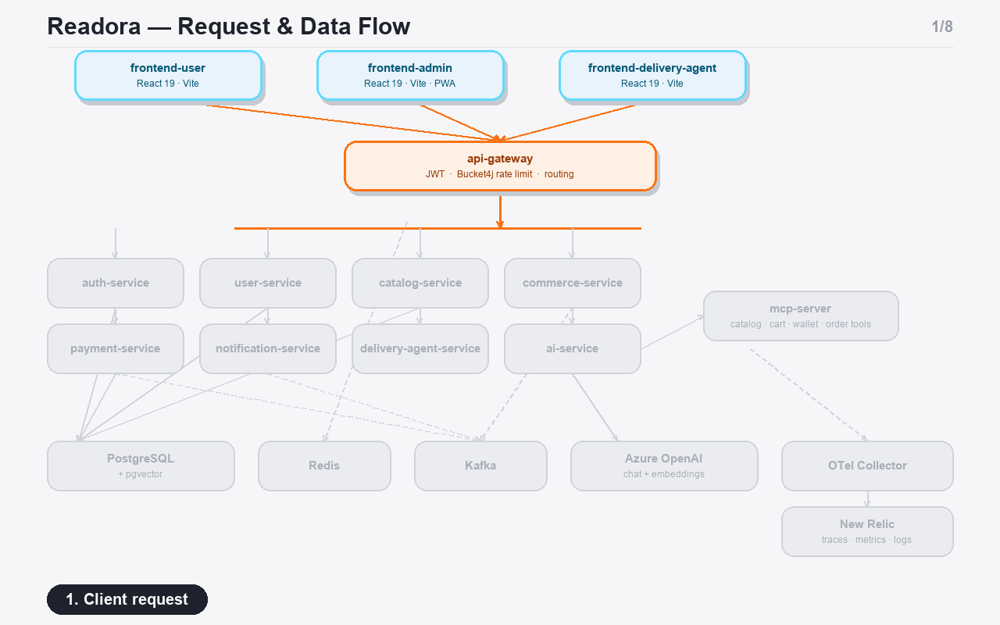
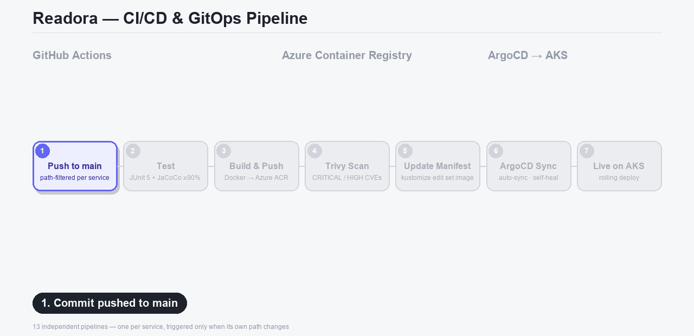
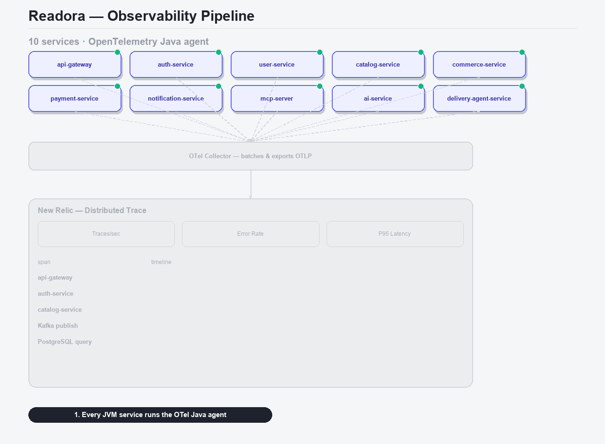

<div align="center">

# 📚 Readora

**A cloud-native, event-driven bookstore platform — 10 Spring Boot microservices, an MCP-powered AI assistant, 3 React frontends, and a full GitOps pipeline to Kubernetes.**

[](https://www.youtube.com/watch?v=BDClXCK8y0o)

[](#)
[](#)
[](#)
[](#)
[](#)
[](#)
[](#)
[](#)

[**▶ Watch Preview Video**](https://www.youtube.com/watch?v=BDClXCK8y0o) · [Architecture](#-architecture) · [Services](#-microservices) · [Getting Started](#-getting-started) · [CI/CD](#-cicd--gitops)

</div>

<br>

[](https://www.youtube.com/watch?v=BDClXCK8y0o)

<br>

## Why this repo

- **AI-native** — a standalone `mcp-server` exposes catalog/cart/wallet/order data as MCP tools; `ai-service` runs a RAG assistant (Azure OpenAI + pgvector) on top of them.
- **Event-driven** — orders, payments, and notifications flow through Kafka, not synchronous chains.
- **Hardened edge** — JWT + Redis-backed rate limiting (Bucket4j) at the gateway before any service is reached.
- **90% coverage gate** — JaCoCo fails the Maven build if business-logic coverage drops below 90%, enforced per service.
- **13 independent pipelines** — GitHub Actions → Trivy scan → GitOps manifest update, path-filtered per service.
- **True GitOps** — ArgoCD auto-syncs AKS from `main`; CI never touches the cluster directly.
- **Full observability** — OpenTelemetry on every JVM service, shipped to New Relic.
- **E2E tested** — 19-spec Playwright suite across auth, checkout, wallet, delivery, and the AI assistant.

## Architecture



Client → gateway → services, with a dedicated MCP layer for AI tool-calling, Kafka for cross-service events, and OpenTelemetry piping everything to New Relic.

## Microservices

| Service | Port | Responsibility |
|---|:---:|---|
| **api-gateway** | 8080 | Spring Cloud Gateway — JWT verification, rate limiting, routing |
| **auth-service** | 8081 | Registration, login, JWT issuance & refresh |
| **user-service** | 8082 | Profiles, wallet & cashback, admin user management |
| **catalog-service** | 8083 | Books, authors, publishers, reviews, inventory |
| **commerce-service** | 8084 | Cart, checkout, orders, coupons |
| **payment-service** | 8085 | Payments, UPI settlement, refunds |
| **notification-service** | 8086 | Real-time WebSocket notifications |
| **mcp-server** | 8087 | Exposes store data as **MCP tools** for AI agents |
| **ai-service** | 8088 | AI reading assistant — Azure OpenAI + pgvector RAG |
| **delivery-agent-service** | 8089 | Delivery claims, live tracking, returns |
| **shared-core** | — | Shared library (JWT utils, config, DTOs) |

## Frontends

| App | Purpose |
|---|---|
| **frontend-user** | Storefront — browsing, checkout, AI chat, in-app e-reader |
| **frontend-admin** | Catalog & order management console (installable PWA) |
| **frontend-delivery-agent** | Delivery agent app — claim, track, complete |
| **shared-ui** | Component library shared by all three apps |

React 19 · TypeScript · Vite 8 · Redux Toolkit · React Hook Form + Zod · STOMP/SockJS.

## Tech Stack

<table>
<tr><td><b>Backend</b></td><td>Java 21 · Spring Boot 3.3 · Spring Cloud Gateway · Spring AI · Spring Data JPA · Flyway · Spring Kafka · Resilience4j · Bucket4j · JJWT</td></tr>
<tr><td><b>Frontend</b></td><td>React 19 · TypeScript · Vite 8 · Redux Toolkit · Framer Motion · pdfjs-dist</td></tr>
<tr><td><b>Data & Messaging</b></td><td>PostgreSQL 16 (pgvector) · Apache Kafka · Redis</td></tr>
<tr><td><b>AI</b></td><td>Azure OpenAI · pgvector similarity search · Model Context Protocol (MCP) · PDFBox</td></tr>
<tr><td><b>Testing</b></td><td>JUnit 5 · Mockito · Testcontainers · JaCoCo (90% gate) · Playwright</td></tr>
<tr><td><b>Observability</b></td><td>OpenTelemetry · OTel Collector · New Relic</td></tr>
<tr><td><b>Infrastructure</b></td><td>Docker · Kubernetes (AKS) · Kustomize · ArgoCD · NGINX Ingress · Azure Container Registry / Blob Storage</td></tr>
<tr><td><b>CI/CD</b></td><td>GitHub Actions (13 path-filtered pipelines) · Trivy vulnerability scanning</td></tr>
</table>

## Repository Structure

```
Readora/
├── services/          # 10 Spring Boot microservices + shared-core (Maven multi-module)
├── frontend/           # frontend-user · frontend-admin · frontend-delivery-agent · shared-ui
├── qa-testing/         # Playwright smoke + API test suites
├── k8s/                 # Kustomize base + overlays, ArgoCD ApplicationSet
├── otel/                # OpenTelemetry Collector config
├── dataset/            # DB setup / seed / cleanup SQL
├── Images/             # README diagrams
└── docker-compose.yml   # Full local stack
```

## Getting Started

- **Path A — Docker Compose:** everything containerized, one command.
- **Path B — Hybrid:** infra in Docker, services run from Maven/IntelliJ — best for active development.

### Prerequisites

| Tool | Version |
|---|---|
| Java (JDK) | 21 |
| Maven | 3.x |
| Node.js + npm | recent LTS |
| Docker + Docker Compose | recent |
| PostgreSQL | 16+ with [pgvector](https://github.com/pgvector/pgvector) (Path B without Docker) |

### Path A — Docker

```bash
curl -fL -o services/artifacts/otel-agent.jar \
  https://github.com/open-telemetry/opentelemetry-java-instrumentation/releases/download/v2.31.1/opentelemetry-javaagent.jar

cp .env.example .env   # fill in required values — see table below
docker compose up --build
```

| App | URL |
|---|---|
| frontend-user | http://localhost:5173 |
| frontend-admin | http://localhost:5174 |
| frontend-delivery-agent | http://localhost:5175 |
| api-gateway | http://localhost:8080 |

```bash
# Seed demo data (after the stack has been up at least once)
cd dataset && psql -h localhost -p 5433 -U readora -d readora -f seed.sql -W
```

### Path B — Hybrid local dev

```bash
# 1. Infra only
docker compose up postgres redis kafka -d

# 2. One-time native Postgres role/database setup
psql -h localhost -p 5432 -U "$(whoami)" -d postgres -f dataset/setup.sql -W

# 3. Run each service's *Application main class from IntelliJ/Maven
#    — schema is created automatically per service via Flyway.

# 4. Seed demo data once auth/user/catalog/delivery-agent have started once
cd dataset && psql -h localhost -p 5432 -U readora -d readora -f seed.sql -W

# 5. Run the frontends
cd frontend && npm install
npm run dev --workspace=frontend-user           # :5173
npm run dev --workspace=frontend-admin          # :5174
npm run dev --workspace=frontend-delivery-agent # :5175
```

Health check any service: `curl http://localhost:9080/actuator/health` (main port + 1000).

### Environment Variables

| Variable | Purpose |
|---|---|
| `POSTGRES_DB_URL` / `POSTGRES_USER` / `POSTGRES_PASSWORD` | Database connection |
| `JWT_SECRET` | Signs/verifies auth tokens |
| `GATEWAY_SECRET` | Shared secret, gateway ↔ services |
| `AZURE_STORAGE_CONNECTION_STRING` / `_CONTAINER_NAME` | Virtual-edition file storage (catalog-service) |
| `AZURE_OPENAI_*` (4 vars) | Chat + embedding deployments (ai-service) |
| `NEW_RELIC_LICENSE_KEY` | OTel Collector export target (optional) |

## Testing & Quality Gates

JUnit 5 + Mockito per service, Testcontainers-backed integration tests, and a JaCoCo gate that fails the build below 90% line coverage on business logic. End-to-end coverage lives in [`qa-testing/`](qa-testing) — Playwright smoke + API suites across auth, checkout, wallet, delivery, and the AI assistant.

```bash
JAVA_HOME=$(/usr/libexec/java_home -v 21) mvn -pl services/<service-name> -am verify   # unit + coverage gate

cd qa-testing && npm install
npm run test:smoke
npm run test:api
```

## CI/CD & GitOps



Each service has its own path-filtered GitHub Actions workflow: test → build & push to ACR → Trivy scan → bump the image tag in `k8s/`. ArgoCD then syncs `main` to AKS on its own — CI commits the manifest change, it never deploys directly.

## Observability



Every JVM service ships the OpenTelemetry Java agent, exporting traces/metrics/logs over OTLP to a central Collector, forwarded to New Relic — full distributed tracing across the gateway → service → Kafka chain with zero manual instrumentation.

## Security

- Stateless **JWT** auth, issued by `auth-service`, verified at `api-gateway`.
- **Gateway shared secret** — downstream services only trust traffic that passed through the gateway.
- **Redis-backed rate limiting** (Bucket4j), shared across gateway instances.
- **Trivy** scans every image on every build, results in GitHub Code Scanning.

---

<div align="center">

Built by **Pavan B N** — [GitHub](https://github.com/Pavan-B-N)

</div>
